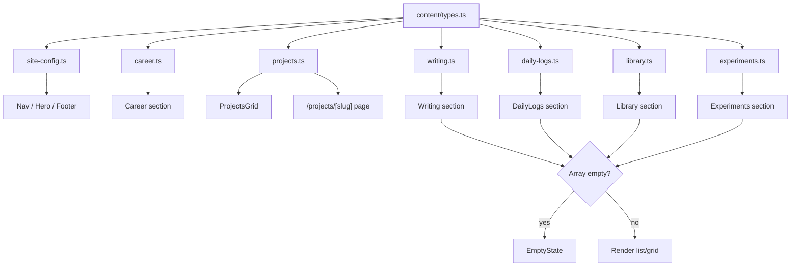
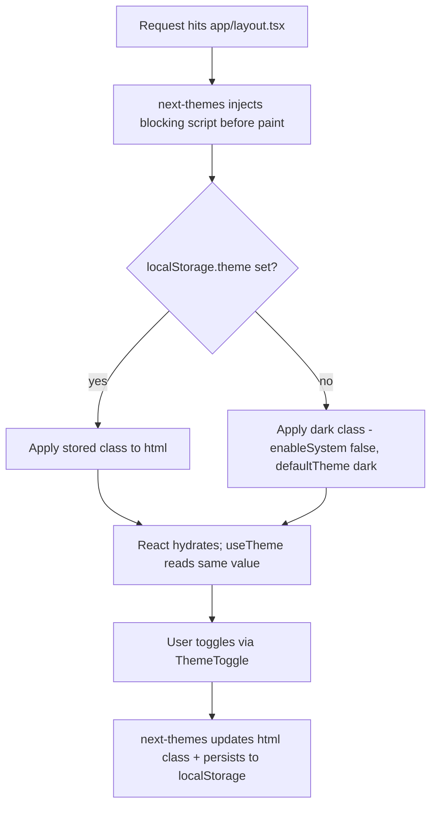
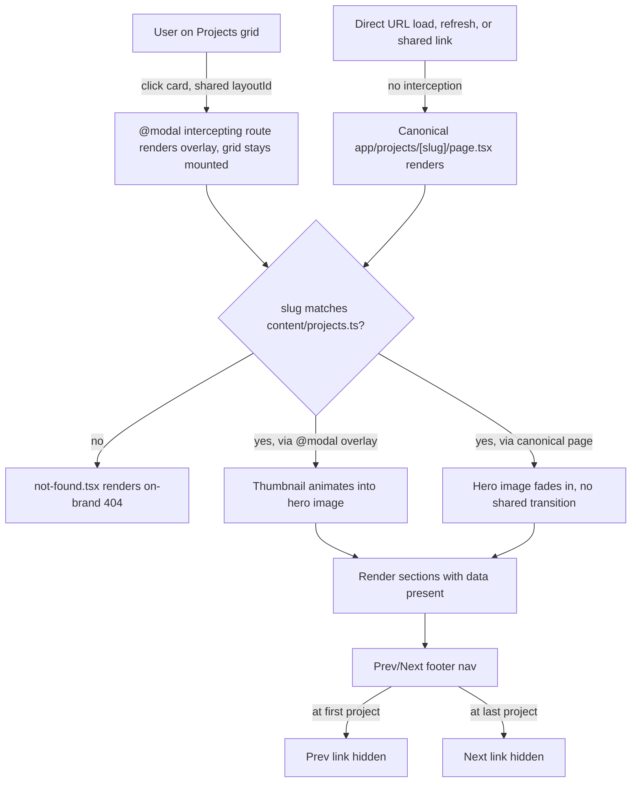

# feat: Vercel-style personal portfolio site

## Summary

Scaffold a single-page personal portfolio in the Vercel design language (pure black background, Geist font, monospace labels, one accent color) using Next.js 16 App Router, TypeScript, Tailwind v4, and Motion. The page composes nine sections (Hero, About, Career, Projects, Writing, Daily Logs, Library, Experiments, Contact) behind a sticky nav, plus a dynamic `/projects/[slug]` detail route. All content lives in typed TypeScript data files under `content/`, seeded with realistic placeholder data, so adding a project, post, or log entry is a data change, not a code change.

## Problem Frame

There is no portfolio site yet — the repository is an empty git init with no code. The site needs to exist to represent the owner's work (career history, projects, writing) to recruiters and collaborators, built to a specific, already-detailed design and structural brief. The AI-chat backend for the nav's "Chat with me" CTA is a separate, larger piece of work the owner will build later; this plan scaffolds the button and a placeholder panel only.

---

## Requirements

**Design system & layout**

- R1. The site renders in the Vercel design language: pure black (`#000`) background, white/gray text, Geist font (Inter documented as fallback), 1px subtle-gray borders, small border-radius (4-8px), generous spacing, and exactly one accent color used only for CTAs, italic emphasis, active nav state, chart lines, and status dots.
- R2. A sticky top nav shows logo/initial + name, section links (Home/About/Career/Projects/Writing/Daily Logs/Library/Experiments/Contact), a dark/light toggle (dark by default), and a "Chat with me" CTA that opens a placeholder panel.
- R3. The site is fully responsive: columns stack on mobile, the career timeline stays vertical, and the sticky career sidebar collapses to an inline block above/below the timeline on narrow viewports.
- R4. Scroll-triggered fade/slide animations and the projects grid-to-detail shared-element transition respect `prefers-reduced-motion` via one shared policy.

**Home page sections**

- R5. Hero section: status badge, oversized name headline, one-paragraph pitch, monospace stat row, "Download resume" CTA, social icon row, portrait photo in a bordered frame (with fallback), and a pausable auto-scrolling status marquee.
- R6. About section: two-column layout with a sidebar card (Toolbox, Achievements, Interests, key-value list) and a bio column with an accent-italic headline word, two narrative paragraphs, and 3 stat callouts.
- R7. Career section: reverse-chronological vertical timeline (year range, role+company, impact description, tag pills) with a sticky right sidebar (pull-quote, hand-rolled sparkline, key-value rows).
- R8. Writing, Daily Logs, Library, and Experiments sections each render their typed content as a list/grid, sharing one `EmptyState` component when a content array is empty.
- R9. Contact section: centered accent-italic headline, warm paragraph, "Say hello" `mailto:` CTA, and footer with copyright, tagline, and social links.

**Projects**

- R10. A projects grid (2-3 col desktop, 2 col tablet, 1 col mobile) links each card to a `/projects/[slug]` detail page via a shared `layoutId` transition from thumbnail to hero image.
- R11. Each project detail page renders header/meta/CTA row, Overview, an optional hand-built SVG Architecture diagram, grouped Tech Stack breakdown, Highlights, Demo, Links, and prev/next project footer nav; any field without data (live URL, GitHub URL, demo media, diagram) hides its section/CTA rather than rendering empty.
- R12. An invalid `/projects/[slug]` renders an on-brand 404 (`not-found.tsx`); prev/next navigation hides the missing side at the first/last project in `content/projects.ts` order.

**Content architecture & scaffold**

- R13. All page content (site config, career, projects, writing, daily logs, library, experiments) lives in typed TypeScript data files under `content/`, so adding an entry is a data change, not a code change.
- R14. The app is scaffolded with Next.js 16 App Router, TypeScript, Tailwind v4, Motion, and `next/font` (Geist), and is deploy-ready for Vercel.

---

## Key Technical Decisions

- **Next.js 16 App Router, Server Components by default**: only leaf components needing Motion, hooks, or browser APIs (theme toggle, mobile menu, chat modal, marquee, animated cards) are marked `"use client"`, keeping the client bundle small and content statically renderable.
- **Tailwind v4 CSS-first theme**: design tokens (palette, monospace font stack, radius scale) are defined via `@theme` in `app/globals.css`, not `tailwind.config.ts` — matches the v4 default and keeps the design system in one file.
- **Geist via the `geist` npm package**: `GeistSans`/`GeistMono` loaded in `app/layout.tsx`; Inter (`next/font/google`) documented as the fallback per the brief, not wired by default.
- **Motion, not framer-motion**: install `motion`, import from `motion/react` — `framer-motion` is the unmaintained legacy package name.
- **`next-themes` for the theme system, not a hand-rolled provider**: `next-themes` with `enableSystem={false}` and `defaultTheme="dark"` gives exactly the strict-dark-default, toggle-only behavior this site needs, out of the box. It injects its own pre-hydration blocking script (so it doesn't flash under any circumstances, including forced themes or incognito storage exceptions) and is a ~1KB, zero-runtime-dependency package. Hand-rolling the same inline script and context provider would recreate a well-known bug surface (hydration mismatches, script-injection ordering) that this library already solves and tests for; `suppressHydrationWarning` on `<html>` is still required either way.
- **Typed content files, no MDX, for every content type**: `content/{site-config,career,projects,writing,daily-logs,library,experiments}.ts`, each exporting a typed array/object from `content/types.ts`. Optional fields default to `[]`/`undefined` in the type so components render unconditionally without scattered null checks.
- **Writing is list/excerpt-only in this plan**: no `/writing/[slug]` detail route. The brief only asks for a list with title/excerpt/date; full article rendering without MDX is a separate authoring-ergonomics decision deferred to follow-up work.
- **Optional per-project fields hide, don't disable**: a missing live URL, GitHub URL, demo media, or architecture diagram means that CTA/section is omitted entirely — never rendered empty or greyed out.
- **Project ordering is array order in `content/projects.ts`**: the grid and prev/next nav both follow declaration order, no implicit date sort. At the first/last project, the missing-side nav link is hidden (no wraparound).
- **Missing images render a shared bordered placeholder**: portrait, project thumbnails, and library covers fall back to an `ImageFallback` initials/icon block styled with the same border language as the rest of the design system, never a broken ``.
- **One shared reduced-motion policy**: a `useReducedMotion` hook wraps Motion's own hook and is consumed by hero entrance, marquee speed, timeline reveals, and the grid→detail `layoutId` transition, instead of each component deciding independently.
- **Marquee pauses on hover/focus/tap and respects reduced motion**: a persistent, always-visible pause/play control (not just hover/focus) gives touch-only visitors a way to stop the auto-scroll, satisfying WCAG 2.2.2 for auto-updating content that runs longer than 5 seconds across both pointer and touch input.
- **Grid→detail shared transition uses a Next.js Intercepting Route**: `/projects/[slug]` is implemented twice — a canonical `app/projects/[slug]/page.tsx` for direct loads, refreshes, and shared links, and an intercepting route `app/@modal/(.)projects/[slug]/page.tsx` (wired through a `@modal` parallel-route slot in the root layout) that renders as an overlay when a card is clicked from the grid. Only the intercepting route keeps the grid mounted underneath it, which is what makes Motion's `layoutId` shared-element transition possible in the first place — a plain client-side navigation to a fully separate page unmounts the grid before the detail page mounts, so there is never a moment both elements coexist for Motion to animate between. Direct navigation or a refresh bypasses interception entirely and renders the canonical page with the existing static fade-in fallback.
- **Chat CTA opens a static placeholder modal**: shows a fixed "AI chat coming soon" message plus the email/social CTA, no input field rendered, so it doesn't imply real interactivity. The AI backend itself is out of scope for this plan.
- **"Say hello" is a `mailto:` link**: no backend dependency for the site's primary conversion action.
- **Architecture diagrams and the career sparkline are hand-built inline SVG React components**: no charting/diagramming library, keeping the bundle light and the visuals strictly monochrome-plus-accent.
- **Icons via `lucide-react`**: social/UI icons (GitHub, LinkedIn, X, Email, arrows, chevrons) stay consistent with the sharp/minimal aesthetic without hand-drawing every icon.
- **Testing stack: Vitest + React Testing Library**: the primary unit-testing path documented in the current Next.js App Router testing guide, faster than Jest for this ESM-native setup; installed and configured in U1 (`vitest`, `@testing-library/react`, `@testing-library/jest-dom`, `jsdom`, `vitest.config.ts`, `test` script) so U2's first `.test.tsx` file has a runner to execute against. `tsc --noEmit` and ESLint are additional gates. Vitest cannot directly test async Server Components (Next.js docs point to e2e for that case) — this directly affects `app/projects/[slug]/page.tsx`, which is necessarily async (dynamic route `params` must be awaited); U9 splits its test scenarios into unit-testable pure-function logic and build/manual-verified page-rendering scenarios accordingly, rather than writing RTL tests against the async page component. No e2e framework is introduced in this plan.
- **Sticky career sidebar disables below the `md` breakpoint**: content stacks inline above/below the timeline instead of using `position: sticky`, avoiding the sidebar bleeding into the Projects section on short-timeline/tall-sidebar viewports.

---

## High-Level Technical Design

### Output structure

```text
app/
  layout.tsx                    # root layout: fonts, ThemeProvider (next-themes), Nav, renders {modal}
  page.tsx                      # composes all home sections
  globals.css                   # Tailwind v4 @import + @theme tokens
  not-found.tsx                 # site-wide 404
  @modal/
    default.tsx                 # renders null when no intercepted route is active
    (.)projects/
      [slug]/
        page.tsx                # intercepted overlay route, shares layoutId with the grid card
  projects/
    [slug]/
      page.tsx                  # canonical detail page (direct loads, refreshes, shared links)
      not-found.tsx             # invalid-slug fallback
components/
  providers/
    ThemeProvider.tsx
  nav/
    Nav.tsx
    MobileMenu.tsx
    ThemeToggle.tsx
    ChatButton.tsx
    ChatModal.tsx
  sections/
    Hero.tsx
    Marquee.tsx
    About.tsx
    Career.tsx
    CareerSparkline.tsx
    ProjectsGrid.tsx
    ProjectCard.tsx
    Writing.tsx
    DailyLogs.tsx
    Library.tsx
    Experiments.tsx
    Contact.tsx
    Footer.tsx
  project-detail/
    ProjectHeader.tsx
    ProjectOverview.tsx
    ProjectArchitecture.tsx
    ArchitectureDiagram.tsx
    ProjectTechStack.tsx
    ProjectHighlights.tsx
    ProjectDemo.tsx
    ProjectLinks.tsx
    ProjectFooterNav.tsx
  ui/
    Button.tsx
    Tag.tsx
    Card.tsx
    SectionLabel.tsx
    EmptyState.tsx
    ImageFallback.tsx
    StatCallout.tsx
content/
  types.ts
  site-config.ts
  career.ts
  projects.ts
  writing.ts
  daily-logs.ts
  library.ts
  experiments.ts
lib/
  use-reduced-motion.ts
  motion-variants.ts
public/
  images/                       # placeholder portrait, project thumbnails, covers
```

### Content flow



### Theme resolution



### Projects grid → detail transition



---

## Scope Boundaries

In scope is everything covered by the Requirements above: the full single-page site, the projects grid and detail route, the typed content architecture, and the placeholder content that populates it.

### Deferred to Follow-Up Work

- The real AI-chat backend (LLM API route, system prompt with bio context, conversation state, streaming UI). This plan scaffolds only the CTA button and a static placeholder modal.
- `/writing/[slug]` detail pages and rich long-form article rendering (MDX or a custom renderer).
- Real personal content: actual name, bio, career history, project data, resume PDF, and portrait photo. This plan ships realistic-but-fictional placeholder content structured for easy swap-out.
- Executing the actual Vercel deployment. The app is deploy-ready; deploying it is a separate action.
- Analytics/SEO work beyond the Next.js Metadata API defaults (OG tags, per-page titles).
- Daily Logs pagination or year-grouping. The feed has no growth-bounding treatment yet; revisit once real entries accumulate.
- Any CMS or non-TypeScript authoring tooling for content.

---

## Implementation Units

### U1. Project scaffold & Tailwind v4 design system foundation

- **Goal:** Initialize the Next.js 16 App Router project with TypeScript, Tailwind v4, ESLint, and the black/near-black/accent design tokens so every later unit builds on a working, styled shell.
- **Requirements:** R1, R14
- **Dependencies:** none
- **Files:**
  - `package.json`, `tsconfig.json`, `next.config.ts`, `postcss.config.mjs` (create)
  - `app/layout.tsx`, `app/globals.css`, `app/page.tsx` (create, minimal placeholder)
  - `eslint.config.mjs`, `vitest.config.ts` (create)
- **Approach:** Scaffold with App Router + TypeScript + Tailwind v4. Define the design system as a CSS-first `@theme` block in `app/globals.css`: `--color-*` (pure black `#000`, near-black surfaces `#0a0a0a`/`#111`, gray text scale, single accent color), `--font-mono-*` for labels, and a small `--radius-*` scale (4-8px). Load `GeistSans`/`GeistMono` from the `geist` package in `app/layout.tsx`. Install and configure the Vitest + React Testing Library harness now (`vitest`, `@testing-library/react`, `@testing-library/jest-dom`, `jsdom`, a `test` script in `package.json`, path aliases matching `tsconfig.json`) so every later unit's `.test.tsx` files have a runner from the start. Pin exact versions of `next`, `tailwindcss`, `motion`, and `vitest` in `package.json` at scaffold time.
- **Test scenarios:**
  - Test expectation: none -- pure scaffolding/config, no behavior to assert; verified via `next build` succeeding, `npx vitest run` executing with zero test files, and a manual render check.
- **Verification:** `npm run build`, `npm run lint`, and `npx vitest run` (zero tests, no errors) all succeed; the placeholder home page renders black background, white text, and Geist font in the browser.

### U2. Theme (dark/light) system

- **Goal:** Add a dark-default theme system with `localStorage` persistence and an FOUC-free toggle, using `next-themes`.
- **Requirements:** R1, R2
- **Dependencies:** U1
- **Files:**
  - `components/providers/ThemeProvider.tsx` (create) — thin wrapper around `next-themes`' provider
  - `components/nav/ThemeToggle.tsx` (create)
  - `app/layout.tsx` (modify — wrap in provider, add `suppressHydrationWarning` on `<html>`)
  - `components/nav/ThemeToggle.test.tsx` (create)
- **Approach:** Install `next-themes`; `ThemeProvider` configures it with `attribute="class"`, `defaultTheme="dark"`, `enableSystem={false}` — no OS `prefers-color-scheme` auto-detection, matching the strict-dark-default requirement. `next-themes` injects its own pre-hydration blocking script and handles `localStorage` persistence internally, so no custom script or resolution logic is needed. `ThemeToggle` is a client component reading/writing theme via `next-themes`' `useTheme()` hook.
- **Test scenarios:**
  - Happy path: clicking `ThemeToggle` calls `next-themes`' `setTheme` and updates the `<html>` class.
  - Happy path: on a second visit with `localStorage.theme = "light"` already set, the page resolves to light with no visible flash.
  - Edge case: no `localStorage.theme` present resolves to dark (`enableSystem={false}` means OS `prefers-color-scheme` is never consulted).
- **Verification:** manual toggle in browser shows no flash of unstyled/wrong-theme content on reload in either theme; `ThemeToggle` test passes.

### U3. Shared UI primitives & content conventions

- **Goal:** Build the small set of primitives every section reuses, encoding the conventions decided during planning (empty states, image fallbacks, reduced motion).
- **Requirements:** R1, R3, R4, R8
- **Dependencies:** U1
- **Files:**
  - `components/ui/Button.tsx`, `Tag.tsx`, `Card.tsx`, `SectionLabel.tsx`, `EmptyState.tsx`, `ImageFallback.tsx`, `StatCallout.tsx` (create)
  - `lib/use-reduced-motion.ts` (create)
  - `components/ui/EmptyState.test.tsx`, `lib/use-reduced-motion.test.ts` (create)
- **Approach:** `Button` supports `primary` (accent-filled) and `outline` variants at small border-radius. `Tag` renders border-only rectangular monospace pills. `SectionLabel` renders the `§ 0N — LABEL` monospace pattern. `ImageFallback` wraps `next/image`, rendering a bordered initials/icon block when `src` is missing. `useReducedMotion` wraps Motion's own `useReducedMotion()` once so every animated component reads from the same hook.
- **Test scenarios:**
  - Happy path: `EmptyState` renders its message when passed no items.
  - Happy path: `ImageFallback` renders the `next/image` when `src` is provided.
  - Edge case: `ImageFallback` renders the initials/placeholder block when `src` is `undefined` or an empty string.
  - Edge case: `useReducedMotion` returns `true` when the OS `prefers-reduced-motion: reduce` media query matches (mocked in test).
- **Verification:** each primitive renders correctly in isolation (component tests) and visually matches the Vercel design language (sharp border, small radius, monospace labels) in a manual check.

### U4. Typed content architecture + placeholder data

- **Goal:** Define the content type contracts and populate every content file with realistic placeholder data.
- **Requirements:** R13
- **Dependencies:** U1
- **Files:**
  - `content/types.ts` (create)
  - `content/site-config.ts`, `content/career.ts`, `content/projects.ts`, `content/writing.ts`, `content/daily-logs.ts`, `content/library.ts`, `content/experiments.ts` (create)
  - `content/projects.test.ts` (create)
- **Approach:** `types.ts` defines `SiteConfig`, `CareerRole`, `Project`, `WritingPost`, `DailyLogEntry`, `LibraryEntry`, `Experiment`. `CareerRole` includes a required numeric `level` field (1-10, author-assigned seniority/scope score) that `CareerSparkline` (U8) plots directly — a named, unambiguous data source rather than an unspecified "progression metric." Only identity fields (`title`/`slug`) and fields every card unconditionally renders are required; everything else (`techStack`, `tags`, `liveUrl`, `githubUrl`, `demo`, `architecture`) is optional or defaults to `[]` so components never null-check ad hoc. Populate 3-4 entries per content type with placeholder-but-realistic data, including one project with an intentionally partial data set (no `liveUrl`) to exercise the hide-not-disable rule end to end.
- **Test scenarios:**
  - Happy path: every exported content array type-checks with no `as any`/`as unknown` casts.
  - Edge case: the project entry missing `liveUrl` has `liveUrl: undefined`, not an empty string, so downstream truthiness checks behave consistently.
  - Integration: the project slug-lookup helper returns the correct entry for a valid slug and `undefined` for an unknown slug.
- **Verification:** `tsc --noEmit` passes with no content-file type errors; the slug-lookup helper is covered by a passing test.

### U5. Sticky nav, mobile menu & chat placeholder modal

- **Goal:** Ship the sticky top nav with section links, theme toggle, mobile collapse, and the chat CTA's placeholder modal.
- **Requirements:** R2, R4
- **Dependencies:** U2, U3, U4
- **Files:**
  - `components/nav/Nav.tsx`, `MobileMenu.tsx`, `ChatButton.tsx`, `ChatModal.tsx` (create)
  - `app/layout.tsx` (modify — render `Nav`)
  - `components/nav/Nav.test.tsx`, `components/nav/ChatModal.test.tsx` (create)
- **Patterns to follow:** `Button`/`Card` primitives from U3; theme context from U2.
- **Approach:** `Nav` is sticky (`position: sticky; top: 0`) with a border-bottom; the active section link uses the accent color, tracked via an `IntersectionObserver` on section anchors (client component). Below the `md` breakpoint, links collapse into `MobileMenu`, triggered by a hamburger icon; opening it traps focus inside the menu, Escape or selecting a link closes it and returns focus to the hamburger trigger, and selecting a link additionally scrolls to the anchor — the same interaction-state treatment as `ChatModal` below. `ChatButton` opens `ChatModal`, a client-component overlay with the static "AI chat coming soon" message, an email link, and Escape/backdrop-click/close-button dismissal — no text input rendered.
- **Test scenarios:**
  - Happy path: clicking a nav link scrolls to the matching section anchor and closes the mobile menu if open.
  - Happy path: clicking the chat CTA opens `ChatModal`, showing the static message and no input field.
  - Edge case: `ChatModal` closes on Escape key, backdrop click, and the close button.
  - Edge case: `MobileMenu` traps focus while open, closes on Escape, and returns focus to the hamburger trigger on close.
  - Edge case: at a mobile viewport width, the nav links are hidden behind the hamburger trigger instead of overflowing.
- **Verification:** manual check at desktop and mobile breakpoints; modal open/close tests pass.

### U6. Hero section + marquee ticker

- **Goal:** Build the hero (badge, headline, pitch, stats, resume CTA, socials, portrait) and the below-the-fold status marquee.
- **Requirements:** R5
- **Dependencies:** U3, U4
- **Files:**
  - `components/sections/Hero.tsx`, `Marquee.tsx` (create)
  - `components/sections/Marquee.test.tsx` (create)
- **Patterns to follow:** `ImageFallback` and `Button` from U3; `useReducedMotion` from U3.
- **Approach:** Hero content pulls from `content/site-config.ts`. Portrait uses `ImageFallback`. The resume CTA links to a placeholder PDF checked into `public/`, consistent with how the portrait and project thumbnails use placeholder assets. `Marquee` duplicates its content track, animates `x` via Motion (`animate={{ x: [...] }, transition: { repeat: Infinity, ease: "linear" }}`), and renders a small always-visible pause/play control so touch-only visitors can stop it (not just hover/focus); it also renders a static (non-animating) track when `useReducedMotion()` is true.
- **Test scenarios:**
  - Happy path: hero renders badge, headline, pitch, stat row, resume link, and social icons from `site-config.ts`.
  - Edge case: a missing portrait `src` renders the `ImageFallback` block instead of a broken image.
  - Edge case: `Marquee` renders the static (non-animating) variant when `useReducedMotion()` returns true.
  - Integration: hovering/focusing the marquee pauses the scroll animation.
  - Integration: tapping the marquee's pause control toggles the animation, independent of hover/focus.
- **Verification:** manual check that the marquee scrolls continuously, pauses on hover, and pauses via the tap control on a touch device; reduced-motion emulation in devtools shows the static variant.

### U7. About section

- **Goal:** Build the two-column About section (sidebar card + bio + stat callouts).
- **Requirements:** R6
- **Dependencies:** U3, U4
- **Files:**
  - `components/sections/About.tsx` (create)
- **Patterns to follow:** `Card`, `Tag`, `StatCallout` from U3.
- **Approach:** The sidebar `Card` renders Toolbox tags, Achievements, Interests, and a key-value list from `content/site-config.ts`/`content/career.ts`. The bio column's headline wraps one word in an accent-italic span; the three stat callouts reuse `StatCallout` from U3.
- **Test scenarios:**
  - Happy path: the sidebar renders all four blocks (Toolbox, Achievements, Interests, key-value list) from content data.
  - Test expectation: no further scenarios beyond happy-path rendering -- this section has no conditional branches or failure modes beyond what U3's and U4's own tests already cover.
- **Verification:** manual visual check against the two-column, stacks-on-mobile layout described in the brief.

### U8. Career section (timeline + sticky sidebar)

- **Goal:** Build the reverse-chronological career timeline and its sticky sidebar with sparkline.
- **Requirements:** R1, R4, R7
- **Dependencies:** U3, U4
- **Files:**
  - `components/sections/Career.tsx`, `CareerSparkline.tsx` (create)
  - `components/sections/CareerSparkline.test.tsx` (create)
- **Patterns to follow:** `Tag` from U3; `useReducedMotion` from U3 for entry reveal animation.
- **Approach:** The timeline renders `content/career.ts` entries most-recent-first as a vertical list with a left rule/marker; each entry shows year range, role+company, impact copy, and `Tag` pills. `CareerSparkline` is a hand-rolled inline `<svg>` `<polyline>` plotting each entry's `level` field (defined on `CareerRole` in U4) against its year, stroked in the accent color. The sidebar uses `position: sticky` from the `md` breakpoint up only; below `md` it renders as a normal stacked block instead.
- **Test scenarios:**
  - Happy path: the timeline renders entries in the order given by `content/career.ts`, most-recent-first.
  - Happy path: `CareerSparkline` renders one point per career entry with no crash at the minimum (1-entry) and typical (4+ entry) data sizes.
  - Edge case: sidebar sticky positioning is disabled below the `md` breakpoint (asserted via the applied class, not a visual snapshot).
- **Verification:** manual scroll check confirms the sidebar sticks only within the Career section and does not bleed into Projects; a mobile viewport shows the sidebar stacked, not sticky.

### U9. Projects grid + dynamic detail route + not-found page

- **Goal:** Ship the projects grid, the `/projects/[slug]` detail page with every subsection, and the invalid-slug 404.
- **Requirements:** R10, R11, R12
- **Dependencies:** U3, U4
- **Files:**
  - `components/sections/ProjectsGrid.tsx`, `ProjectCard.tsx` (create)
  - `app/projects/[slug]/page.tsx`, `app/projects/[slug]/not-found.tsx` (create — canonical route)
  - `app/@modal/default.tsx`, `app/@modal/(.)projects/[slug]/page.tsx` (create — intercepting overlay route)
  - `app/layout.tsx` (modify — accept and render the `modal` parallel-route slot)
  - `components/project-detail/ProjectHeader.tsx`, `ProjectOverview.tsx`, `ProjectArchitecture.tsx`, `ArchitectureDiagram.tsx`, `ProjectTechStack.tsx`, `ProjectHighlights.tsx`, `ProjectDemo.tsx`, `ProjectLinks.tsx`, `ProjectFooterNav.tsx` (create)
  - `components/project-detail/section-visibility.ts`, `section-visibility.test.ts` (create — pure-function optional-field visibility logic)
- **Patterns to follow:** `Card`, `Tag`, `SectionLabel`, `ImageFallback` from U3; slug-lookup helper and its existing test coverage from U4 (not re-tested here).
- **Approach:** `ProjectsGrid` renders `content/projects.ts` in array order at 1/2/3 columns (mobile/tablet/desktop) with `layoutId={`project-${slug}`}` shared between the card thumbnail and the detail page's hero image. The canonical `app/projects/[slug]/page.tsx` uses `generateStaticParams()` sourced from `content/projects.ts` and calls `notFound()` for an unmatched slug, rendering `not-found.tsx`. The intercepting `app/@modal/(.)projects/[slug]/page.tsx` renders the same content as an overlay reached only via a grid-card click, sharing the grid's mounted tree so the `layoutId` transition has something to animate between; `app/@modal/default.tsx` renders `null` when no intercepted route is active. Each detail subsection (shared by both routes) renders only when its corresponding data is present (`liveUrl`, `githubUrl`, `demo`, `architecture`), decided by a small `section-visibility.ts` helper the page components call rather than inlining the checks. `ArchitectureDiagram` is a hand-built `<svg>` of bordered boxes and accent arrows driven by a small typed diagram-node/edge shape on the project's content entry. `ProjectFooterNav` computes prev/next from array position, hiding the missing side at the array boundaries, and links via the canonical route (no interception needed between two detail pages).
- **Test scenarios:**
  - Happy path (unit): `section-visibility.ts`'s pure functions are covered directly with Vitest — this is the portion of U9 new logic that can be unit-tested, since the page components themselves are async Server Components that Vitest/RTL cannot render (see Testing stack KTD).
  - Edge case (unit): a project missing `liveUrl` resolves to "hide the View live CTA" in `section-visibility.ts`; same for `githubUrl`, `demo`, and `architecture` — none resolve to "render empty or disabled".
  - Integration (unit): `generateStaticParams()` output matches the slugs in `content/projects.ts` exactly (no extras, no omissions).
  - Happy path (build/manual): every project in the placeholder data renders its detail page via the canonical route without error, with every optional section/CTA present for the full-data project.
  - Happy path (manual): clicking a grid card opens the `@modal` intercepting route and the shared `layoutId` transition animates the thumbnail into the hero image; navigating back returns to the grid.
  - Edge case (manual): direct navigation to `/projects/[slug]` (no prior grid element, no interception) renders the hero image with a plain fade-in via the canonical route, not a broken shared transition.
  - Edge case (build): an unknown slug renders `not-found.tsx` on the canonical route, not a crash or blank page.
  - Edge case (manual): the first project in `content/projects.ts` hides its "prev" link; the last hides "next".
- **Verification:** the `section-visibility.ts` unit tests pass; every project in the placeholder data renders its detail page without error via manual check; `not-found.tsx` renders for a fabricated invalid slug; `npm run build` statically generates all canonical project routes; the grid→modal `layoutId` transition is confirmed visually in the browser.

### U10. Writing / Daily Logs / Library / Experiments sections + Contact + footer

- **Goal:** Ship the remaining content-driven sections, the closing Contact CTA, and the site footer.
- **Requirements:** R8, R9
- **Dependencies:** U3, U4
- **Files:**
  - `components/sections/Writing.tsx`, `DailyLogs.tsx`, `Library.tsx`, `Experiments.tsx`, `Contact.tsx`, `Footer.tsx` (create)
  - `components/sections/Writing.test.tsx` (create — empty-state coverage, representative of the shared pattern)
- **Patterns to follow:** `EmptyState`, `Card`, `Tag`, `ImageFallback` from U3.
- **Approach:** Each of Writing/Daily Logs/Library/Experiments maps its `content/*.ts` array to cards/rows and renders `EmptyState` when the array has zero entries (a plain length check, since KTD defaults empty arrays to `[]` rather than `undefined`). Library additionally renders a fixed 1-5 star rating and an optional book cover image via `ImageFallback`, matching the same missing-image fallback used for the portrait and project thumbnails. Contact renders the centered accent-italic headline and a `mailto:` "Say hello" CTA; `Footer` renders the copyright/tagline line and the same social icon set as the hero.
- **Test scenarios:**
  - Happy path: each section renders one card/row per entry in its content array.
  - Edge case: each section renders `EmptyState` when its content array has zero entries (test at least Writing and Daily Logs explicitly; Library and Experiments share the identical code path).
  - Happy path: Contact's "Say hello" CTA is an `<a href="mailto:...">` pointing at the address in `content/site-config.ts`.
- **Verification:** manual check with a temporarily-emptied content array confirms `EmptyState` renders instead of a blank section.

### U11. Page composition, animation wiring, responsive & accessibility pass, build verification

- **Goal:** Assemble the full single-page app from all sections, wire scroll-triggered animations and smooth-scroll nav anchors, and verify the build end to end.
- **Requirements:** R1, R3, R4, R14
- **Dependencies:** U5, U6, U7, U8, U9, U10
- **Files:**
  - `app/page.tsx` (modify — compose all sections in order)
  - `app/not-found.tsx` (create — site-wide 404, distinct from the projects one)
  - `app/layout.tsx` (modify — final metadata, smooth-scroll CSS)
  - `lib/motion-variants.ts` (create)
- **Approach:** Compose sections into `app/page.tsx` in brief order (Hero → About → Career → Projects → Writing → Daily Logs → Library → Experiments → Contact); wrap each section's entrance in a shared `useReducedMotion`-aware `whileInView` variant from `lib/motion-variants.ts`. Add smooth-scroll behavior (respecting reduced motion) and section `id` anchors matching the nav links. Run a full responsive pass at mobile/tablet/desktop breakpoints across every section, and confirm `next build`, `next lint`, and `tsc --noEmit` all pass clean.
- **Test scenarios:**
  - Integration: clicking each nav link scrolls to and reveals the corresponding section anchor.
  - Edge case: with `prefers-reduced-motion: reduce` emulated, section entrances render without animation delay (content visible immediately, not stuck at zero opacity).
  - Test expectation: no additional unit-level scenarios beyond the above -- full-app composition has no new branching logic beyond what U5-U10 already cover; this unit is primarily verified by build/lint/typecheck plus manual responsive review.
- **Verification:** `next build` succeeds with all routes (home, every project slug, and both not-found pages) generated where applicable; `next lint` and `tsc --noEmit` pass; a manual pass at 375px/768px/1440px viewports shows every section stacking/responsive as specified with no layout overflow.

---

## Risks & Dependencies

- **Framework version drift:** Next.js 16, Tailwind v4, and Motion's rename from `framer-motion` are all recent; pin exact versions in `package.json` at scaffold time (U1) so a later install doesn't silently pull breaking changes into an in-progress build.
- **Theme hydration mismatch:** the single highest-risk interaction in the app, mitigated by `next-themes`' injected blocking script and `suppressHydrationWarning` (see Key Technical Decisions); verify manually in both themes immediately after U2 lands.
- **Placeholder content authenticity:** the site ships with fictional bio/project/resume data (see Scope Boundaries); it is not production-ready for public sharing until real content is swapped in.
- **Motion bundle weight:** heavy scroll/layout animation usage across many sections could affect performance scores; the shared reduced-motion policy and small `"use client"` boundaries are the primary mitigations, but a dedicated performance pass is not separately scoped in this plan.
- **Content-update friction:** typed TypeScript content files are a data change in the sense that no component code changes, but adding an entry (especially to Daily Logs, which implies frequent updates) still requires editing a source file, passing `tsc`/lint, and triggering a rebuild/redeploy — the same cycle as any code change. This is an accepted launch-time tradeoff, not a CMS-equivalent authoring experience; revisit only if update frequency makes the friction painful in practice.

---

## Sources / Research

- Framework research (`ce-framework-docs-researcher`, dispatched during planning): confirmed Next.js 16 App Router conventions, Tailwind v4's CSS-first `@theme` setup, the `geist` npm package for font loading, Motion's rename from `framer-motion` (import from `motion/react`), and `"use client"`/hydration pitfalls that shaped the KTDs above.
- Flow and edge-case analysis (`ce-spec-flow-analyzer`, dispatched during planning): surfaced the theme FOUC handling, 404/not-found routing gap, optional-field hide-don't-disable rule, shared reduced-motion policy, empty-state pattern, image-fallback pattern, chat-placeholder scoping, and prev/next boundary behavior that are now encoded as KTDs and per-unit test scenarios.
- Deepening research (`ce-best-practices-researcher`, dispatched during the confidence-check pass): confirmed `next-themes` (`enableSystem={false}`, `defaultTheme="dark"`) is a documented exact match for the strict-dark-default requirement and eliminates a hand-rolled FOUC/hydration bug surface, and confirmed Vitest + React Testing Library remains the Next.js-documented default testing path, with async Server Components as a noted, accepted coverage gap.
- Multi-persona document review (coherence, feasibility, design-lens, scope-guardian, and adversarial reviewers): identified and resolved the missing Contact nav link, the unscaffolded test harness in U1, the grid→detail `layoutId` transition's need for a Next.js Intercepting Route (a plain client-side navigation unmounts the grid before the detail page mounts, so Motion has nothing to animate between without one), the undefined `CareerSparkline` metric, missing touch/keyboard interaction coverage on the marquee and mobile menu, and the undefined resume-CTA fallback.
